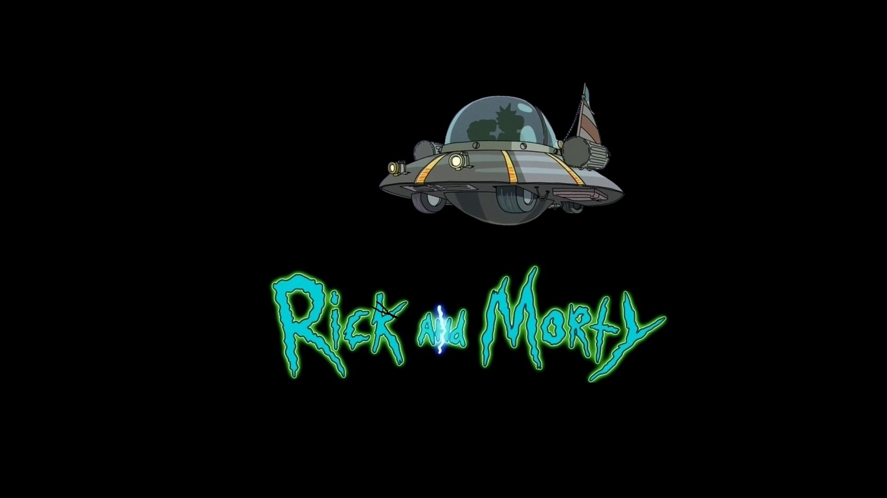

# Top Memory Card

Um jogo de memória desenvolvido com React (Vite) utilizando personagens da Rick and Morty API.
O objetivo é simples: clicar em cada personagem apenas uma vez. Se o usuário clicar no mesmo card duas vezes, a pontuação atual é reiniciada e apenas o Top Score é mantido.



[Ver preview hospedado](https://top-memory-card-gs0du9n84-thiago-nadims-projects.vercel.app)

## Funcionalidades

- Carregamento dinâmico dos personagens por ID via Rick and Morty API
- Cards interativos com suporte a teclado (Enter/Space)
- Placar exibindo pontuação atual e maior pontuação atingida
- Embaralhamento dos cards a cada jogada
- Interface responsiva com grade adaptável

## Como executar o projeto

1. Instalar dependências

```bash
npm install
```

2. Iniciar o servidor de desenvolvimento

```bash
npm run dev
```

Após isso, basta abrir o endereço exibido pelo Vite (geralmente `http://localhost:5173`).

## Arquitetura do projeto

- `index.html` — ponto de entrada da aplicação
- `src/main.jsx` — inicialização do React
- `src/App.jsx` — componente raiz da aplicação
- `src/components/CardContainer.jsx` — lógica de pontuação, embaralhamento e renderização dos cards
- `src/components/Card.jsx` — card individual, responsável por buscar e exibir dados do personagem
- `src/styles/` — arquivos CSS (`App.css`, `CardContainer.css`, `Card.css`)
